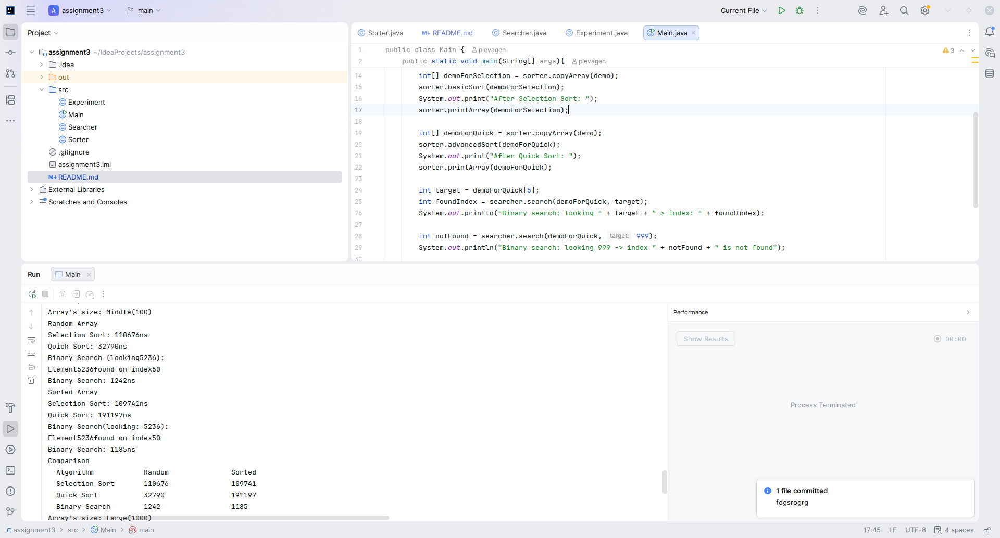
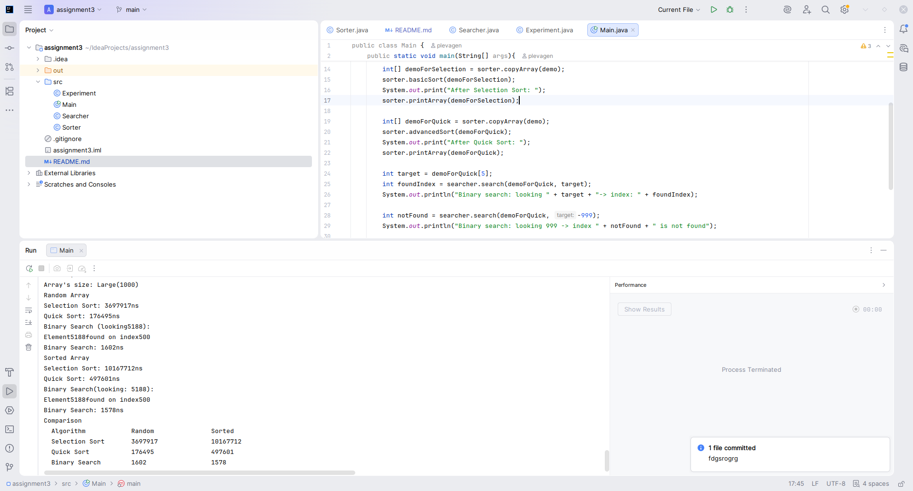

# Assignment3-ADS

A. PROJECT OVERVIEW:
-
The project implements and compares 3 algorithms:
1) Selection Sort - a basic simple algorithm that works slowly with large data. The difficulty - O(n^2)
2) Quick sort - one of the most efficient and used sorting algorithms. Difficulty - O(nlogn)
3) Binary search - a highly efficient algorithm for finding elements. Difficulty - O(logn)

The purpose of this experiment is to run algorithms and compare their performance in different array sizes and input data.

---
B. ALGORITHM DESCRIPTIONS:
-
1. Selection Sort:

How it works: The algorithm divides the array into two parts: sorted (at the beginning) and unsorted. At each step, 
we find the minimum element in the unsorted part and swap it with the first element of this part, thereby increasing the
sorted part by one element. The process repeats until the entire unsorted part is gone

Time Complexity:

Best Case - O(n^2)

Middle Case - O(n^2)

Worst Case - O(n^2)

2. Quick Sort:

How it works: The algorithm is of the "Divide and conquer" type (that is, splitting the problem into 2, smaller subtasks and splitting until the elements become basic, then a combined solution and combining the results of the subtasks). A pivot is selected from the array. The elements that are smaller than the pivot are shifted to the left, and those that are larger are shifted to the right. Then apply this approach until the sorting is complete.

Time Complexity:

Best Case - O(nlogn)

Middle Case - O(nlogn)

Worst Case - O(n^2)

3. Binary Search

How it works: It works on the principle of "Divide and conquer". The middle element in the array is selected. If the middle element is equal to the one you are looking for, then the search ends. If the search is less than the average, the search is in the left half, if it is more, in the right half. It runs until the desired value is found.

Time Complexity:

Best Case - O(1)

Middle Case - O(logn)

Worst Case - O(logn)

---

C. EXPERIMENTAL RESULTS
-

Tests run on: Random arrays and Sorted arrays. 

Sizes: 10, 100, 1000.

---
1. Array size: 10

---
1. Type: Random 

a) Selection Sort: 5648 ns

b) Quick Sort: 6831 ns

c) Binary Search: 2494 ns

---
1.1 Type: Sorted

a) Selection Sort: 2439 ns

b) Quick Sort: 4647 ns

c) Binary Search: 1260 ns

---

2. Array Size: 100

---
1.Type: Random

a) Selection Sort: 110 676 ns

b) Quick Sort: 32 790 ns

c) Binary Search: 1242 ns

---

1.2. Type: Sorted

a) Selection Sort: 109 741 ns

b) Quick Sort: 191 197 ns

c) Binary Search: 1185 ns

---

3. Array Size: 1000

---

1. Type: Random

---

a) Selection Sort: 3 697 917 ns

b) Quick Sort: 176 495 ns

c) Binary Search: 1602 ns

---

1.2. Type: Sorted

a) Selection Sort: 10 167 712 ns

b) Quick Sort: 497 601 ns

c) Binary Search: 1578 ns

E. ANALYSIS
-

1) For working with a small array, selection sorting is best (As can be seen from the results, the time to perform selection sorting is 2 times faster than fast (5648 ns versus 6831 for a random array and 2439 ns versus 4647 for a sorted one)). However, for medium and large arrays, it is better to use quick sort. The complexity of the selection sort is O(n^2) everywhere, while the quick sort is O(nlogn)
2) Selection Sort slows down dramatically — doubling the array size roughly quadruples the time. Quick Sort scales much better — doubling the size only doubles the time (approximately).
3) Selection Sort performs identically on both — it always scans the full unsorted part. Quick Sort can degrade on already-sorted arrays when using a naive pivot (last element) because the pivot is always the maximum, creating unbalanced partitions (worst case O(n²)).
4) Yes. Selection Sort shows roughly 100× slowdown from n = 100 to n = 1000 (10^2 = 100), while Quick Sort shows only ~10× slowdown (10log10 ≈ 10×).
5) Binary Search works by eliminating half the remaining elements at each step — it can only do this if it knows which half contains the target. In an unsorted array, knowing the middle element is smaller than the target tells us nothing about where the target is.

F. REFLECTION
-

I've learned that Big-O notation is very important when implementing algorithms. Selecting Sort is easy to understand and implement, but the speed difference becomes apparent when you test it on 1000 items compared to Quick sort.
It is also worth noting my surprise when I realized that advanced sorting can be slower than simple sorting if we work with small data. This suggests that in practice, constants and data sizes should also be taken into account when working with sorting algorithms.
When writing Quick Sort, I ran into the problem that I need to correctly implement the steps of partitioning arrays and transferring copies of arrays to the algorithm. It was necessary for fair results.
